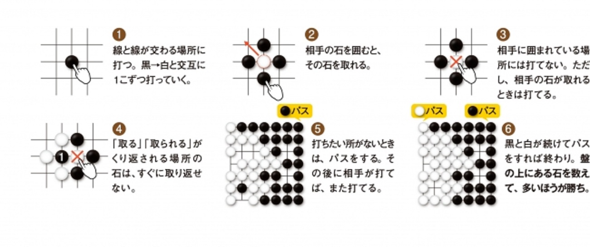
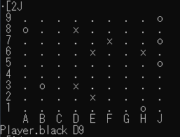
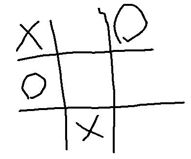

# 第2章　機械学習の問題としての囲碁
## 内容
- ゲームAIとは
- ゲームAIの全体構造
---
# ゲームのAIについて
- ゲームはAI研究の題材として以下の理由から好まれる。
    - 現実の複雑さを単純化しているため
    - 決定に必要な情報が全てルールに含まれるため
    - 間違えても現実世界に影響がないため

- ゲームのAIは基本的に以下の全体構造持つ。
    1. 序盤での着手の選択
    2. 局面の探索
    3. 検討する着手の削減
    4. 局面の評価
～次頁にて上記の詳細を説明～

---
# 1.序盤での着手の選択
- ゲームの序盤は勝敗が決まるまでの分岐が膨大すぎるので、特定の着手を評価することが困難
- ゆえにチェスや囲碁AIは、熟練した人間の対局に基づく序盤データベースを持つ
    - 熟練者の棋譜において次の着手に強い一致がある場合に定石としてデータベースに追加する
- なおチェスは終盤のデータベースを持つが、囲碁には適用されない
    - チェスは終盤につれて盤上の駒が減るためパターンが少ない
    - 囲碁は終盤につれて盤上の石が増えるためパターンが多い
---
# 2.局面の探索
- 木探索アルゴリズムがコアとなる概念
    - 人間は、「可能な着手を考え、相手の行動を予測し、その手が良いか評価する。その後、立ち返って別の着手を考えて・・・」と局面を探索する。
    - コンピュータは木探索アルゴリズムを用いて人間と同様に局面を探索する。
---
# 3.検討する着手の削減（1/2）
- 囲碁の局面分岐は非常に膨大であり、全てを評価するのは困難
- ゆえに、検討する数を絞り込むことが重要

### ゲームの局面のおよその数
||分岐の数が30の場合(チェス)|分岐の数が250の場合(囲碁)|
|:---|---:|---:|
|2手後|900|62,500|
|3手後|27,000|1.5億|
|4手後|810,000|40億|
|5手後||2.4億|1兆|
---
# 3.検討する着手の削減（2/2）
- 盤面の重要な部分を確実に識別するルールを書くことは非常に困難であるため、、ルールをもとにして着手を選択する方法が「検討する着手の削減」タスクではあまり使えない。
    - 人間は、「玉飛車接近すべからず」などの格言（ルール）をもとに着手を絞るが、その格言が合ってるかわからん。
- 深層学習は、上記タスクに適している。
    - 深層学習は、熟練者の棋譜に基づいて、次の着手を予測するタスクを簡単に学習できる。
    - 予測された着手を検討する着手とし、木探索する枝のランク付けを行う。
---
# 4.局面の評価
- 分岐の数によりAIがどれだけ先まで読めるか制限される
    - 三目並べなら勝敗が付くまで探索し、勝敗でスコアを決める。
    - 囲碁では、勝敗ではなく探索したすべての局面に対してスコアをつけてその中で最高スコアになる手を選択する。
- 囲碁での局面の評価は着手の選択よりも困難な場合がある
    - 囲む領域の境界は終局まで不明瞭であり、取った石の数はあまり役に立たない。
- 深層学習は、局面の評価に対して大きなブレークスルーとなった
    - 局面から誰が勝つかを予測するように学習させることで、予測の確率を局面の評価に利用可能

---

# 第３章　最初の囲碁ボットの実装
## 内容
- 囲碁のルールの説明
- 囲碁プログラムの実装
- ランダムな囲碁ボットの実装
---
# 囲碁のルール

囲碁ルール
https://prtimes.jp/i/7567/52/resize/d7567-52-578181-2.jpg

---
# 囲碁プログラムの実装：概略
- Playerクラス：Enumでプレイヤー1,2を定義するクラス
- Pointクラス：盤上のx,y座標を定義するクラス
- Moveクラス：３つの動作（打つ、パス、投了）を定義するクラス
- GoStringクラス：石の連（上下左右でくっついた石の集合）を管理するクラス
    - 単体の石で管理するより連で管理した方が計算量が減る
- Boardクラス：盤面と、石を置いたときの処理を定義するクラス
- GameStateクラス：ゲームの状態(手番、現在の局面、前のゲーム状態、最後の着手、着手のルール)を管理するクラス

なお、本書のソースコードは以下から入手可能。
https://github.com/maxpumperla/deep_learning_and_the_game_of_go

---

# 囲碁エージェントの実装
- 全てのボットは以下のAgentクラスを継承してselect_moveメソッドを実装する
```
class Agent():
    def __init__(self):
        pass
    
    def select_move(self, game_state):
        raise NotImplementedError()
```

---

# ランダムな囲碁ボットの実装
- 合法手の中から１交点ランダムに選んでプレイするボット
```
class RandomBot(Agent):
    def select_move(self, game_state):
        # 合法手が打てる交点を全て列挙する。
        candidates = []
        for r in range(1, game_state.board.num_rows + 1):
            for c in range(1, game_state.board.num_cols + 1):
                candidate = Point(row=r,col=c)
                if game_state.is_valid_move(Move.play(candidate)) and \
                    not is_point_an_eye(game_state.board,
                    candidate,
                    game_state.next_player
                    ):
                    candidates.append(candidate)
            if not candidates:
                return Move.pass_turn()
        # 列記した交点の中から１交点を選んでプレイする。
        return Move.play(random.choice(candidates))
```

---

# ランダムな囲碁ボット同士の対戦
- <1>ボットが交互にselect_moveメソッドを実行し、着手を決める。
- <2>決めた着手をapply_moveメソッドにより盤面に適用する。
```
def main():
    board_size = 9
    game = goboard.GameState.new_game(board_size)
    bots = {
        gotypes.Player.black: naive.RandomBot(),
        gotypes.Player.white: naive.RandomBot(),
    }
    while not game.is_over():
        time.sleep(0.3)
        print(chr(27) + "[2J") 
        print_board(game.board)
        bot_move = bots[game.next_player].select_move(game) # <1>
        print_move(game.next_player, bot_move)
        game = game.apply_move(bot_move) # <2>

if __name__ == '__main__':
    main()
```

---
# 実行画面



---

# 第４章　木探索によるゲームプレイ
## 内容
- 木探索アルゴリズムとゲームの分類
- ミニマックスアルゴリズムによる最善手探索
- ミニマックス木探索の枝刈りによる計算速度向上
- モンテカルロ木探索の適用

---
# 木探索アルゴリズムとゲームの分類
- 木探索アルゴリズムは、「手番を順番に持ち各手番に別々の選択肢があるゲーム」に有効
    - リアルタイムストラテジーゲーム等には適用困難
- 上記のゲームには２つの特徴により分類される
    - 確定と不確定：ゲームの経過がプレイヤーの決定のみに依存するか否か
    - 完全情報と不完全情報：各プレイヤーがゲームの状態全てを見れるか否か

||確定|不確定|
|:---:|:---:|:---:|
|完全情報|囲碁、チェス|バックギャモン|
|不完全情報|潜水艦ゲーム、軍人将棋|ポーカー、スクランブル|

---

# ミニマックス法とは
- 想定される最大の被害が最小となるように決断する手法
    - 以下の三目並べを例とすると、相手の勝ち筋を潰す中央を取る。
        - 中央を取られると上中と右下のダブルリーチになるため


---
# ミニマックス探索の囲碁ボットの実装
## 勝ち負けの定義
```
class GameResult(enum.Enum):
    loss = 1
    draw = 2
    win = 3
```

---
# ミニマックス探索の囲碁ボットの実装
- best_result()は現状から勝利できるか否かを返す関数
```
class MinimaxAgent(Agent):
    def select_move(self, game_state):
        winning_moves = []
        draw_moves = []
        losing_moves = []
        for possible_move in game_state.legal_moves():
            next_state = game_state.apply_move(possible_move)
            opponent_best_outcome = best_result(next_state)
            our_best_outcome = reverse_game_result(opponent_best_outcome)
            if our_best_outcome == GameResult.win:
                winning_moves.append(possible_move)
            elif our_best_outcome == GameResult.draw:
                draw_moves.append(possible_move)
            else:
                losing_moves.append(possible_move)
        if winning_moves:
            return random.choice(winning_moves)
        if draw_moves:
            return random.choice(draw_moves)
        return random.choice(losing_moves)
```

---
# best_resultの実装
```
def best_result(game_state):
    # ゲームが終わっているなら結果を返す。
    if game_state.is_over():
        if game_state.winner() == game_state.next_player:
            return GameResult.win
        elif game_state.winner() is None:
            return GameResult.draw
        else:
            return GameResult.loss
    # 候補手の探索
    best_result_so_far = GameResult.loss
    for candidate_move in game_state.legal_moves():
        next_state = game_state.apply_move(candidate_move)    
        opponent_best_result = best_result(next_state)
        our_result = reverse_game_result(opponent_best_result)
        if our_result.value > best_result_so_far.value:     
            best_result_so_far = our_result
    return best_result_so_far

```